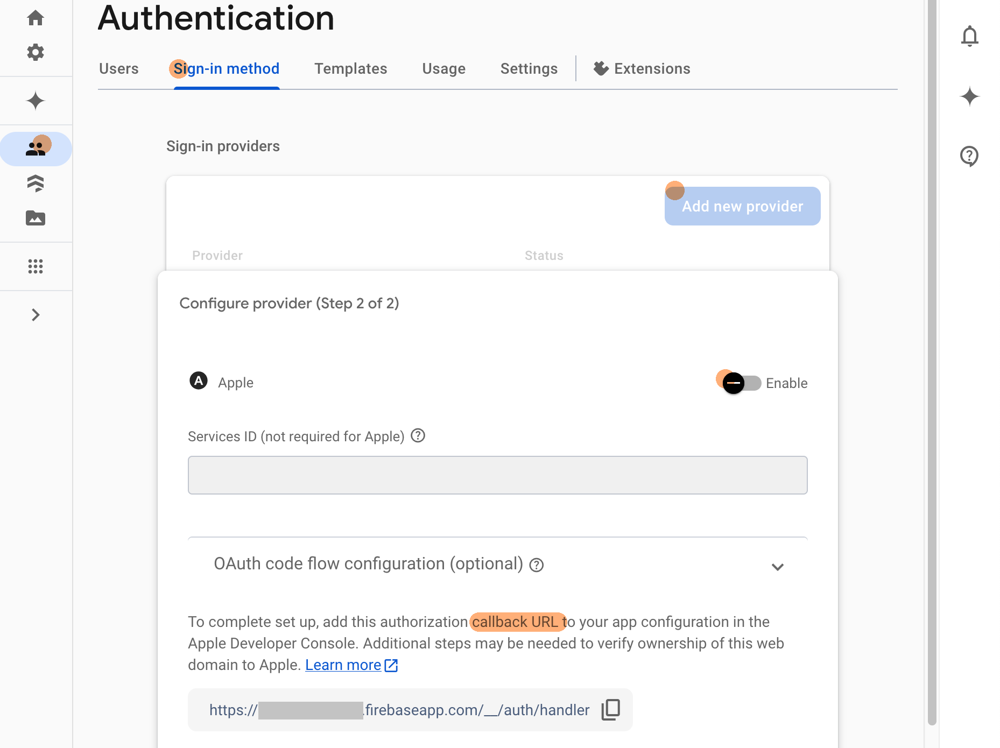

# {{ $frontmatter.title }}

{{ $frontmatter.description }}

1. 在 `Firebase Console` > `Authentication`, 启动 `Sign in with Apple`. 记下 Firebase 提供的 `callback URL`.
   
2. 在 `Apple Developer` > [Certificates, Identifiers & Profiles](https://developer.apple.com/account/resources) 找到当前应用. 增加 `Sign in with Apple` 能力, 同时填入之前之前步骤记下的 `callback URL`.
   
3. 在 `Xcode` 中增加 `Capability` > `Sign in with Apple`
   
4. 增加 `Sign in with Apple` 相关的代码
   ```ts
   // src/stores/auth.ts
   import { FirebaseAuthentication } from '@capacitor-firebase/authentication'

   const signInWithApple = async (): Promise<User | null> => {
      try {
         const { user } = await FirebaseAuthentication.signInWithApple()
         console.log('[signInWithApple] success, uid = ', user?.uid)
         currentUser.value = user
         return user
      }
      catch (error) {
         console.log('[signInWithApple] error ', JSON.stringify(error, null, 2))
         return null
      }
   }
   ```
5. 如果整合是成功的, 点下苹果登录的按钮后, 一个描述为 "Create an account for APP_NAME using your Apple ID YOUR_APPLE_ID" 的对话框会弹出
   
