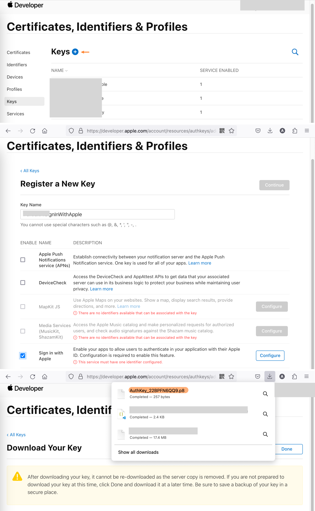
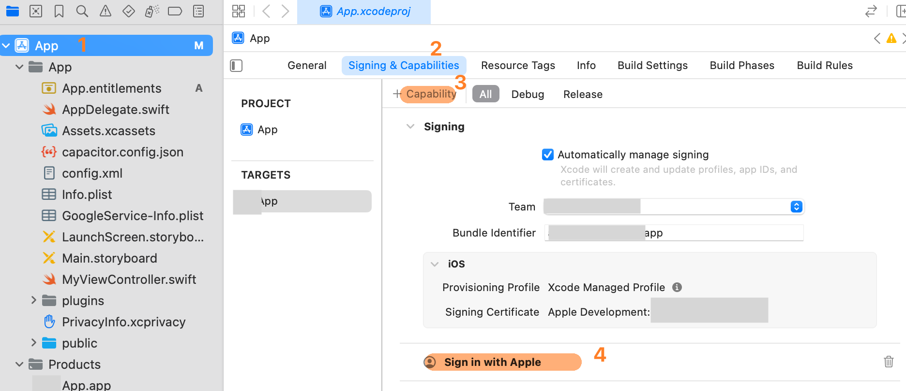
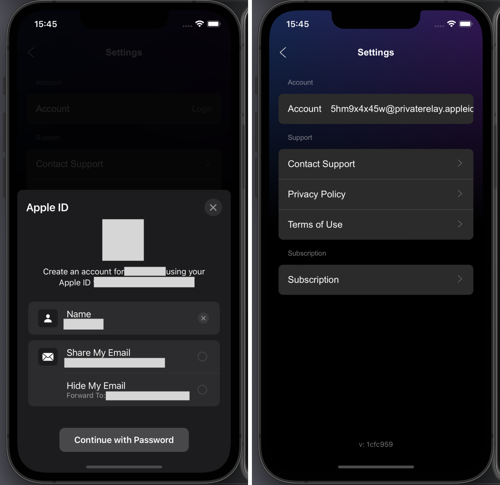

# {{ $frontmatter.title }}

{{ $frontmatter.description }}

1. 在 Firebase Console > Auth, 启动 Sign in with Apple. 记下 Firebase 提供的 callback URL.
2. 在 Apple developer > [Certificates, Identifiers & Profiles](https://developer.apple.com/account/resources) 找到当前应用.
3. 增加 Sign in with Apple 能力, 同时填入之前之前步骤记下的 callback URL
   
4. 在 https://developer.apple.com/account/resources/authkeys/list 页面, 创建一个新的`key`, 记得必须勾选 `Sign in with Apple`, 下载该`key`.
   
5. 在 `Xcode` 中增加 `Capability` > `Sign in with Apple`
   
6. 增加 `Sign in with Apple` 相关的代码
7. 如果整合是成功的, 点下苹果登录的按钮后, 一个描述为 "Create an account for APP_NAME using your Apple ID YOUR_APPLE_ID" 的对话框会弹出
   
