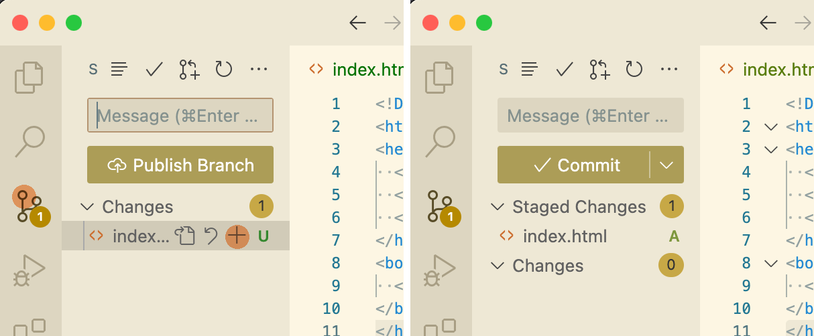
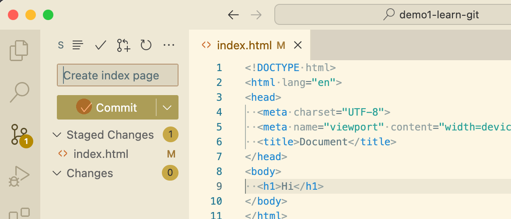
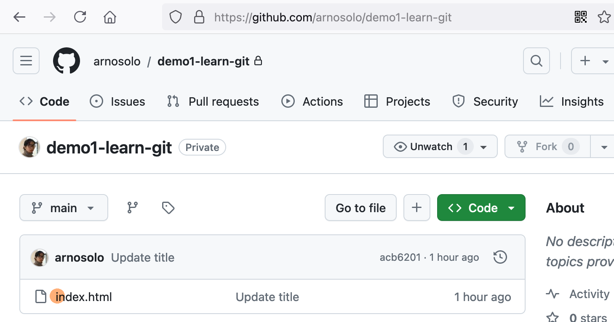
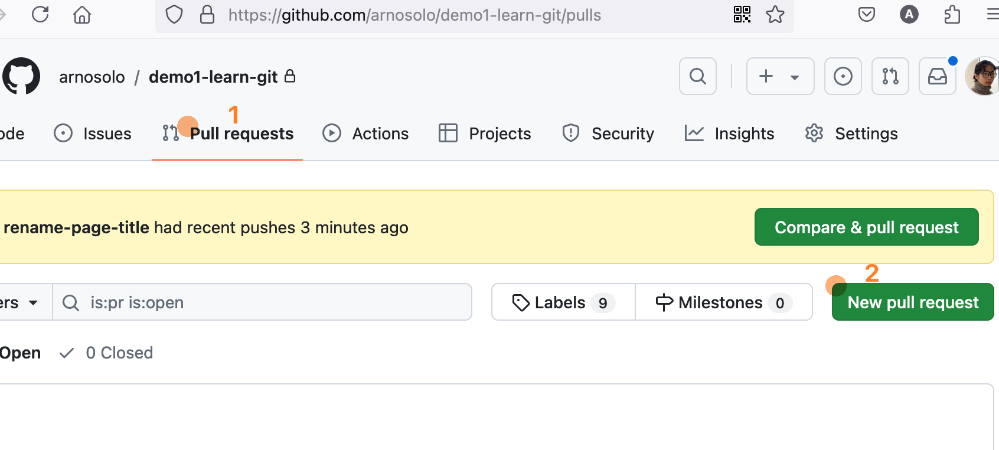
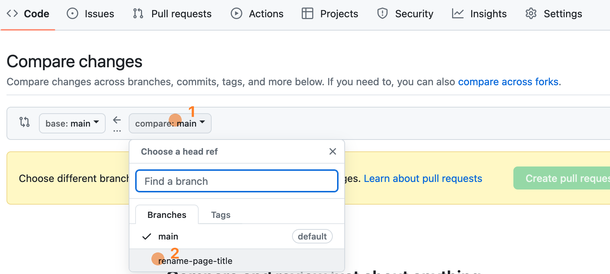
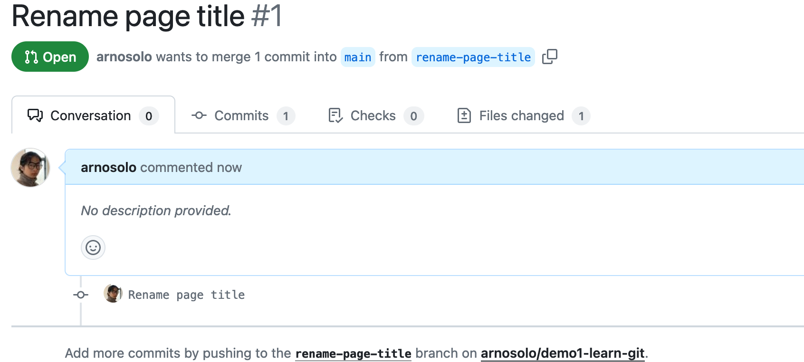

# {{ $frontmatter.title }}

{{ $frontmatter.description }}

## 创建 Github 仓库

### 初始化 Git

```zsh
# 创建文件夹
mkdir demo1-learn-git
# 进入文件夹
cd demo1-learn-git
# 初始化 Git
git init
```

列出该目录下的所有文件, 如果多出了一个 `.git` 文件夹, 则初始化成功.
```zsh
ls -a
```

### 增加 commit

这一步使用了[VS Code 文本编辑器](https://code.visualstudio.com/)来帮助理解.

1. 使用`VS Code`打开上一步创建的文件夹.
2. 在该文件夹下创建一个文件, 可以是任何文件, 这里我选择创建一个`index.html`文件
```html
<!DOCTYPE html>
<html lang="en">
<head>
  <meta charset="UTF-8">
  <meta name="viewport" content="width=device-width, initial-scale=1.0">
  <title>Document</title>
</head>
<body>
  <h1>Hello</h1>
</body>
</html>
```
1. 接下来我们将`index.html`文件放入`暂存区(index)`. 实现的方式有两种, 第一种是使用`VS Code`的图像界面进行操作. 具体来说就是先点击左侧导航栏中的分支图标按钮, 然后将`Changes`列表下的点击`index.html`行中的加号. 点击后我们会发现`index.html`行会从`Changes`列表转移到`Staged Changes`. 此时我们便知道`index.html`文件被放入了`暂存区`.
   
2. 上一步操作也可以使用命令行来完成. 当你输入此命令时, 图形界面会同步变化.
   ```bash
   git add index.html # 放入暂存区
   git rm index.html # 移出暂存区
   ```
3. 这一步, 我们使用`暂存区`的文件变化创建一个`commit`. 第一种是图形界面的方式. 在 Message 输入框中输入一段文字, 然后点击 Commit 按钮.  它的等效命令是
   ```bash
   git commit -m "Create index page"
   ```
4. 列出所有的`commits`
   ```bash
   git log

    # f8563535fa07b82892b04b8100799308d61a06c7 是当前 commit 的 ID
    commit f8563535fa07b82892b04b8100799308d61a06c7 (HEAD -> main)
    Author: Arno Solo <..@outlook.com>
    Date:   Tue Jun 18 21:09:47 2024 +0800
    Create index page
   ```
5. 尝试在多增加几个`commits`, 比如说把网页的标题修改为"Ha ha".

> 你可以使用 `git -h` 命令列出帮助信息

### 撤销 commit

1. 首先列出所有的`commits`
   ```bash
   git log

    commit acb6201a4cc1038014eb19ce1f84337ab79fc767 (HEAD -> main)
    Author: Arno Solo <...@outlook.com>
    Date:   Wed Jun 19 06:27:15 2024 +0800
    Update title

    commit f8563535fa07b82892b04b8100799308d61a06c7
    Author: Arno Solo <...@outlook.com>
    Date:   Tue Jun 18 21:09:47 2024 +0800
    Create index page
   ```
2. 然后撤销`commit`. 预期最新的一个`commit`会被移除, 转入`暂存区`
   ```bash
   git reset --soft HEAD~1
   git log

    commit f8563535fa07b82892b04b8100799308d61a06c7 (HEAD -> main)
    Author: Arno Solo <...@outlook.com>
    Date:   Tue Jun 18 21:09:47 2024 +0800
    Create index page
   ```
3. 最后撤回上一步的撤销操作. 预期上一步撤销的`commit`又出现在了`commit`记录的顶部
   ```bash
   git reset 'HEAD@{1}'
   git log

    commit acb6201a4cc1038014eb19ce1f84337ab79fc767 (HEAD -> main)
    Author: Arno Solo <...@outlook.com>
    Date:   Wed Jun 19 06:27:15 2024 +0800
    Update title

    commit f8563535fa07b82892b04b8100799308d61a06c7
    Author: Arno Solo <...@outlook.com>
    Date:   Tue Jun 18 21:09:47 2024 +0800
    Create index page
   ```

### 上传代码到 Github 仓库

#### 首次上传

1. 打开 https://github.com 网站.
2. (如需) 注册一个 Github 帐号.
3. 创建一个[新的repository](https://github.com/new). `仓库(Repository)`类型选择`Private`.
4. 创建完成后, 您将会被重定向到`repository`的详情页. 可以看到上传代码的基本的流程已被给出.
   ```bash
    # 添加一个名为 origin 的远程仓库
    git remote add origin https://github.com/YOUR_USER_NAME/demo1-learn-git.git

    # 重命名当前分支为 main. -M 的意思是 move
    git branch -M main

    # 将本地的 main 分支上传到叫做 origin 的远程仓库. 同时设置本地 main 分支的 upstream 分支为 origin 仓库的 main 分支
    git push -u origin main
   ```
5. 刷新 Github 仓库网页, 预期此时仓库不再为空.
   

#### 再次上传

当又有新的`commit`被创建, 需要再次上传时, 就不再需要设置远程仓库了, 直接使用`git push`命令即可.
```bash
git push
```

## 发起 Pull Request

在多人合作的项目中, 我们作为普通开发者一般没有使用`git push`命令直接上传代码的权限. 此时我们就需要发起一个 `Pull Request` 请求项目维护者合并我们的`commit`.

### 创建分支

1. 首先, 列出所有分支. 可以看到, 一共有两个分支, 一个是`main`分支. 另一个是`origin/main`分支, 也就是`main`分支的远程分支
   ```bash
    git branch -avv
    * main                acb6201 [origin/main] Update title
      remotes/origin/main acb6201 Update title
   ```
2. 创建一个新的分支`rename-page-title`
   ```bash
   git checkout -b rename-page-title
   git branch -avv
   ```
3. 尝试在`rename-page-title`分支和`main`分支之间相互切换
   ```bash
   git checkout main
   git checkout rename-page-title
   ```

### 修改代码

1. 切换到`rename-page-title`分支, 开始修改`index.html`的代码
   ```diff
   - <h1>Ha ha</h1>
   + <h1>Hello</h1>
   ```
2. 将改动后的`index.html`文件放入`暂存区`
   ```bash
    git add index.html
   ```
3. 使用`暂存区`中的文件创建一个`commit`
    ```bash
    git commit -m "Rename page title"
    ```
4. 打印 git 日志. 预期一个新的`commit`被创建, 且不是在`main`分支
   ```bash
   git log

    commit 1856f815500d8923503b99fcb542e2acc6dd6df7 (HEAD -> rename-page-title)
    Author: Arno Solo <...@outlook.com>
    Date:   Wed Jun 19 08:07:36 2024 +0800
    Rename page title

    commit acb6201a4cc1038014eb19ce1f84337ab79fc767 (origin/main, main)
    Author: Arno Solo <...@outlook.com>
    Date:   Wed Jun 19 06:27:15 2024 +0800
    Update title
   ```

### 上传分支

1. 上传分支
   ```bash
   git push -u origin rename-page-title
   ```
2. (可选) 列出所有分支, 预期会出现 origin/rename-page-title 分支
   ```bash
   git branch -avv
      main                             acb6201 [origin/main] Update title
    * rename-page-title                1856f81 [origin/rename-page-title] Rename page title
      remotes/origin/main              acb6201 Update title
      remotes/origin/rename-page-title 1856f81 Rename page title
   ```
3. 后续有改动时使用
   ```bash
   git push
   ```

### 创建 Pull Request

1. 打开你的 Github 仓库, 点击 `Pull Request` 标签, 点击 `New pull request`
   
2. 选择对比分支为 `rename-page-title`
   
3. 点击`Create pull request`
4. 复制新创建的 `Pull Request` 的地址, 发给有 `Pull Request` 合并权限的人. 示例 https://github.com/arnosolo/demo1-learn-git/pull/1
   

### 合并 Pull Request

1. 仓库维护者打开你发送的`Pull Request`地址, 开始阅读你的`commits`
2. 如果他觉得你的修改没有问题, 他就会点击网页上的 `Merge pull request` 来合并你的代码.
3. 代码被仓库维护者合并的意思是, `origin/main`分支(也就是 Github 上的分支)上增加了一个`commit`, 里面是你发起的 `Pull Request` 的内容.
4. 我们可以使用 `git pull` 命令获取最新的变化.
5. 此时我们再列出 git 日志, 可以发现最新的`commit`的消息中显示它创建自一个 `Pull Request` 的合并.
   ```bash
   git log

   commit f7dd80caa809bbf71c28673cc2293568579edc13 (HEAD -> main, origin/main)
   Merge: acb6201 1856f81
   Author: Arno Solo <46125820+arnosolo@users.noreply.github.com>
   Date:   Sat Jun 22 12:09:34 2024 +0800
      Merge pull request #1 from arnosolo/rename-page-title
      Rename page title
   ```